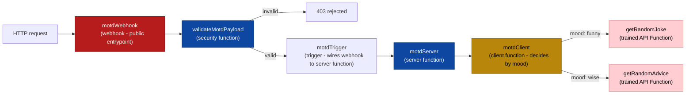

# poly-getting-started

Welcome! This guide is a walk-through setting up a local
environment and deploying the working example in this repository to the
[PolyAPI](https://polyapi.io/) platform.

By the end of this guide you will have:

-   A working Node.js/TypeScript development environment (macOS or Windows).
-   This project connected to our PolyAPI tenant.
-   A generated PolyAPI SDK.
-   The example in [`src/`](./src) deployed end-to-end:



## Contents

1. [Key concepts](#1-key-concepts)
2. [Prerequisites](#2-prerequisites)
3. [Install Node.js and npm](#3-install-nodejs-and-npm)
4. [Get the project and install dependencies](#4-get-the-project-and-install-dependencies)
5. [Connect the CLI to our PolyAPI tenant](#5-connect-the-cli-to-our-polyapi-tenant)
6. [Project structure](#6-project-structure)
7. [Train API Functions](#7-train-api-functions)
8. [Deploy to the PolyAPI platform](#8-deploy-to-the-polyapi-platform)
9. [Wire the webhook](#9-wire-the-webhook)
10. [Test it end-to-end](#10-test-it-end-to-end)

-   [What's next](#whats-next)
-   [Troubleshooting](#troubleshooting)

## 1. Key concepts

PolyAPI implementations are built from a small set of constructs:

| Construct             | What it is                                                                            | In our example                     |
| --------------------- | ------------------------------------------------------------------------------------- | ---------------------------------- |
| **Webhook**           | A public HTTP endpoint that receives requests                                         | `motdWebhook`                      |
| **Trigger**           | Wiring that connects a webhook to a server function                                   | `motdTrigger`                      |
| **Server function**   | Backend logic that runs on the PolyAPI platform                                       | `motdServer`                       |
| **Client function**   | Reusable logic callable from server (or client) functions                             | `motdClient`                       |
| **API Function**      | Typed wrapper around a real HTTP endpoint, generated ("trained") from an OpenAPI spec | `getRandomJoke`, `getRandomAdvice` |
| **Security function** | A server function that validates/authorizes a webhook request before it's let through | `validateMotdPayload`              |

All resources in this example live under the `covetrus2.demo2` context on our
shared Covetrus PolyAPI tenant.

## 2. Prerequisites

-   Access to our Covetrus PolyAPI tenant: **base URL** (e.g. `https://na2.polyapi.io`)
    and an **API key**. Ask your PolyAPI admin if you don't have these yet.
-   A code editor (VS Code recommended).
-   Git (to clone/manage the project repository).

## 3. Install Node.js and npm

You need **Node.js 18 or later (20+ recommended)**. `npm` is installed
automatically with Node.js.

### macOS

Install Node.js with Homebrew:

```bash
brew install node
```

### Windows

Open **PowerShell or Command Prompt** and run:

```powershell
winget install OpenJS.NodeJS.LTS
```

Accept the UAC prompt if one appears, then close that terminal and switch to
Git Bash for the rest of this guide.

### Verify your installation

```bash
node -v      # v18.x.x or higher
npm -v
```

## 4. Get the project and install dependencies

Clone the repository and move into it:

```bash
git clone <this-repo-url> poly-getting-started
cd poly-getting-started
```

Install dependencies:

```bash
npm install
```

Create your local environment file from the template:

```bash
cp .env.example .env
```

Fill in `.env` with the tenant base URL and your personal API key:

```bash
POLY_INSTANCE_URL=https://na2.polyapi.io
POLY_API_KEY=your_poly_api_key_here
```

## 5. Connect the CLI to our PolyAPI tenant

Run the interactive setup once per machine. It stores your base URL and API
key locally so the CLI and generated SDK can talk to PolyAPI:

```bash
npx poly setup
```

You'll be prompted for the same **base URL** and **API key** you put in
`.env`. You can also pass them directly instead of the interactive prompts:

```bash
npx poly setup https://na2.polyapi.io <your-api-key>
```

You'll also be asked whether you want to use a project template:

```text
? Do you want to use a project template?
  1) No (empty project)
  2) Default Project (instance)
```

Choose **1) No (empty project)** — this repo already has its own webhook,
server function, and client function under [`src/`](./src), so there's
nothing for a template to scaffold.

## 6. Project structure

Each deployable `.ts` file exports a `polyConfig` object describing itself to
the platform, plus the actual function implementation:

-   [`src/triggers/motdTrigger.ts`](./src/triggers/motdTrigger.ts) +
    [`motdTrigger.config.json`](./src/triggers/motdTrigger.config.json) — script that wires the webhook to the server function
-   [`src/webhooks/motdWebhook.ts`](./src/webhooks/motdWebhook.ts) — public POST entrypoint, gated by `validateMotdPayload`
-   [`src/serverFunctions/motdServer.ts`](./src/serverFunctions/motdServer.ts) — calls `motdClient`, returns the combined greeting
-   [`src/serverFunctions/validateMotdPayload.ts`](./src/serverFunctions/validateMotdPayload.ts) — security function; rejects invalid `name`/`mood` before the trigger fires
-   [`src/clientFunctions/motdClient.ts`](./src/clientFunctions/motdClient.ts) — picks an API Function by mood, returns its content
-   [`src/apiFunctions/jokeApi.openapi.yaml`](./src/apiFunctions/jokeApi.openapi.yaml) — spec trained as the `getRandomJoke` API Function
-   [`src/apiFunctions/adviceApi.openapi.yaml`](./src/apiFunctions/adviceApi.openapi.yaml) — spec trained as the `getRandomAdvice` API Function

API Functions don't have a hand-written `.ts` implementation — `npm run models:generate` (step 7) turns each spec into a `.model.json` file next to it, which is what actually gets trained.

[`src/webhooks/motdWebhook.ts`](./src/webhooks/motdWebhook.ts) already
uses `slug: "covetrus-motd"`, the shared slug for this tutorial's webhooks on
our tenant. If you deploy your own copy of this webhook for experimentation,
change `name` (and `slug` if you want a separate URL) so it doesn't collide
with the shared one.

## 7. Train API Functions

Not every integration needs hand-written code. If a real HTTP API already
exists, PolyAPI can generate a typed wrapper function for it directly from an
OpenAPI spec — no request/response handling to write by hand. This is called
**training** an API Function.

This project trains two, each from a small OpenAPI spec describing one free,
no-auth demo API:

-   [`src/apiFunctions/jokeApi.openapi.yaml`](./src/apiFunctions/jokeApi.openapi.yaml) — trains `getRandomJoke`
-   [`src/apiFunctions/adviceApi.openapi.yaml`](./src/apiFunctions/adviceApi.openapi.yaml) — trains `getRandomAdvice`

`motdClient` calls whichever one matches the `mood` field in the
webhook payload (see [step 10](#10-test-it-end-to-end)). Neither demo API
publishes its own OpenAPI spec, so these were hand-written to cover just the
one endpoint each function needs — you don't need an API's own documentation
to train against it, just an accurate spec for the calls you want to make.

**Generate** a Poly model file from each spec (this uses AI to fill in
descriptions):

```bash
npm run models:generate
```

This writes `jokeApi.model.json` / `adviceApi.model.json` next to their
specs — open one to see the generated function name, description, and
inferred return type.

**Validate**, then **train** them. Training is the step that actually creates
the API Functions on the platform:

```bash
npm run models:validate
npm run models:train
```

After this, `getRandomJoke` and `getRandomAdvice` exist under the
`covetrus2.demo2` context on the platform, ready to be pulled into your local
SDK the next time you run `npm run generate` (step 8).

## 8. Deploy to the PolyAPI platform

Deploying pushes the local `.ts` deployables (client functions, server
functions, webhooks) up to PolyAPI:

```bash
npm run deploy
```

This runs `poly sync`, which scans the whole project for files exporting a
`polyConfig` (typed `PolyClientFunction`, `PolyServerFunction`, or
`PolyWebhook`) and creates or updates the matching resource on the platform.
After it deploys a file, it stamps a comment at the top like:

```typescript
// Poly deployed @ 2026-07-03T10:00:00.000Z - covetrus2.demo2.motdServer - https://na2.polyapi.io/... - a1b2c3d4
```

Leave that comment in place — it's how the tool tracks what's already
deployed.

> Tip: preview what would change without deploying anything with
> `npx poly sync --dry-run`.

Once deployed, pull those changes into your local SDK:

```bash
npm run generate
```

This regenerates the typed bindings under `node_modules/.poly`, so
`motdClient`, `motdServer`, and the two API Functions trained in step 7
(`getRandomJoke`, `getRandomAdvice`) all become available as typed `poly.*`
calls locally, e.g. `poly.covetrus2.demo2.motdServer({ name: "Ada", mood: "funny" })`.
Re-run `npm run generate` any time the platform-side catalog changes —
whenever you or a teammate add or change functions, webhooks, or other
constructs.

## 9. Wire the webhook

`poly sync` doesn't reliably wire two things onto a webhook: the trigger that
connects it to a server function, and the `securityFunctions` that validate
its payload. Both need a one-time manual step.

### Connect it to the server function (trigger)

Triggers aren't created by `poly sync`, so run the trigger script once. It
reads `POLY_INSTANCE_URL` / `POLY_API_KEY` from `.env`, finds the deployed
webhook and server function named in
[`motdTrigger.config.json`](./src/triggers/motdTrigger.config.json),
and creates (or updates) the trigger connecting them:

```bash
npm run setup:trigger
```

You should see output like:

```text
Trigger 'motdTrigger' created successfully (id: ...).
```

Re-running the same command later will update the existing trigger instead of
creating a duplicate — safe to re-run any time the config changes.

### Add payload validation (security function)

[`src/serverFunctions/validateMotdPayload.ts`](./src/serverFunctions/validateMotdPayload.ts)
is a normal server function — `npm run deploy` (step 8) deploys it like any
other. The tricky part is wiring it into
[`motdWebhook.ts`](./src/webhooks/motdWebhook.ts)'s
`securityFunctions`, which references it by platform-assigned `id`:

```typescript
securityFunctions: [
    {
        id: "1ee8f8ed-480b-46bb-bb7b-a31868522018",
        message: "Invalid or missing field in event payload.",
    },
],
```

That `id` only exists after `validateMotdPayload` has been deployed
once — grab it from the `// Poly deployed @ ...` comment `poly sync` stamps
at the top of the file after deploying it, then paste it into the webhook's
`securityFunctions` and run `npm run deploy` again.

## 10. Test it end-to-end

Once deployed, get this webhook's actual invoke URL from its details page in
the PolyAPI dashboard (Canopy PolyUI) — it includes an environment-specific
subdomain, so it won't match the tenant base URL you used for `poly setup`.
For our tenant/environment it looks like this:

```bash
curl -X POST 'https://94021a50.na2.polyapi.io/apis/covetrus-motd/motd' \
  --header 'Content-Type: application/json' \
  --header 'Authorization: Bearer <your-poly-api-key>' \
  --data '{ "name": "Ada", "mood": "funny" }'
```

Expected response — `motdClient` called the trained `getRandomJoke` API
Function, since `mood` is `"funny"` (the joke itself is random, so the exact
text will differ each call):

```json
"Hi Ada! Why did the burglar hang his mugshot on the wall? ... To prove that he was framed!"
```

Send `"mood": "wise"` instead to hit the trained `getRandomAdvice` API
Function:

```json
"Hi Ada! Mercy is the better part of justice."
```

That's the `motdServer` server function's actual return value — not the
webhook's own `responsePayload`. The trigger's `waitForResponse` setting (in
[`motdTrigger.config.json`](./src/triggers/motdTrigger.config.json))
controls whether the call is synchronous or asynchronous from the caller's
point of view:

-   `waitForResponse: true` (used here) — synchronous: the caller waits for
    `motdServer` server function to finish and gets its return value back as the response.
-   `waitForResponse: false` — asynchronous: the caller gets the webhook's own
    `responsePayload` back immediately, while `motdServer` function keeps running in
    the background.

Now send an invalid payload (missing `name`, or a `mood` other than
`"funny"`/`"wise"`) to see `validateMotdPayload` reject it before the
trigger — and `motdServer` — ever run:

```bash
curl -X POST 'https://94021a50.na2.polyapi.io/apis/covetrus-motd/motd' \
  --header 'Content-Type: application/json' \
  --header 'Authorization: Bearer <your-poly-api-key>' \
  --data '{ "name": "Ada", "mood": "dummy" }'
```

```json
{ "statusCode": 403, "message": "Invalid or missing field in event payload." }
```

## What's next

You now have a deployed webhook → trigger → server function → client function
chain, validated by a security function and choosing between two trained API
Functions — the skeleton we'll build on. Next steps typically look like:

-   Train API Functions against a real Covetrus/3rd-party API instead of demo
    ones, using its actual OpenAPI spec where one exists.
-   Replace the webhook's payload schema with the real event contract, and
    extend `validateMotdPayload` to match.
-   Add `vari` entries for config/secrets the functions need (e.g. API base
    URLs, credentials), and `tabi` entries if you need to persist structured
    data.

## Troubleshooting

-   **TypeScript can't find `poly.covetrus2.demo2.*`** — that namespace only
    exists after you've run `npm run deploy` and then `npm run generate` in
    this project. It's expected to be missing beforehand.
-   **`poly generate` doesn't show my new function/webhook** — make sure
    `npm run deploy` finished without errors first; `generate` only reflects
    what's actually deployed.
-   **A trained API Function's fields all come back `undefined`** — API
    Functions return `ApiFunctionResponse<T>`, an envelope of
    `{ status, data, headers, metrics }`, not the raw response body. The
    actual payload is under `.data` — e.g. `getRandomJoke()` resolves to
    `{ data: { setup, punchline, ... }, status, ... }`, not `{ setup,
punchline, ... }` directly.
-   **TypeScript can't find `poly.covetrus2.demo2.getRandomJoke`/`getRandomAdvice`**
    — these come from `npm run models:train` (step 7), not `npm run deploy`.
    Run `npm run models:generate` → `npm run models:validate` →
    `npm run models:train` in order, then `npm run generate` to pull them into
    your local SDK.
-   **`npx poly setup` fails to connect** — double-check the base URL includes
    the protocol (`https://...`) and that your API key hasn't expired.
-   **Trigger script can't find the webhook or server function** — confirm
    `npm run deploy` deployed both first, and that `context`/`name` in the
    `.ts` files exactly match
    [`motdTrigger.config.json`](./src/triggers/motdTrigger.config.json).
-   **401 from the webhook** — check the `Authorization: Bearer <api-key>`
    header, since `requirePolyApiKey: true` is set.
-   **403 from the webhook even with a valid payload** — `poly sync` may have
    silently dropped your `securityFunctions` update (see the "Known CLI gap"
    note in [step 9](#9-wire-the-webhook)). Confirm with
    `GET /webhooks/<webhook-id>` (not the `GET /webhooks` list, which omits
    `securityFunctions`), and PATCH it directly if it's out of sync with
    [`motdWebhook.ts`](./src/webhooks/motdWebhook.ts).
